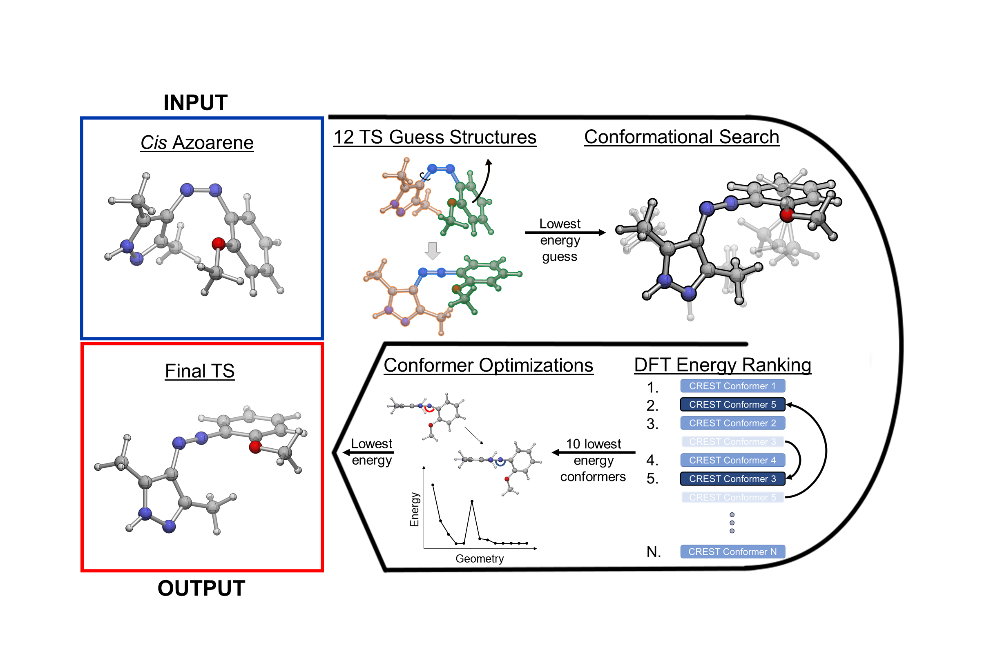

# EZ-TS
Automatic Azoarene Transition State Screening



## CODE SETUP

1. Clone the repository to your home directory:
```
$ git clone https://github.com/lopez-lab/EZ-TS.git
```
2. Execute ~/EZ-TS/init.sh to set up $USER information, local directories, and copy the EZTS tools to your ~/bin for easy access:
```
$ bash init.sh
```
3. Dependent Packages:
    * OpenBabel must be installed prior to use
    * If starting calculations from SMILES, RDKIT environment must be active
    * Paths to all QM package executables should be set in the master ~/EZ-TS/config.py file (Gaussian16, CREST, ORCA)

## USAGE
EZ-TS handles the setup and management of calculations by generating a batch of transition state guess structures for each molecule and writing a chain of calculation input/sbatch files to carry out the numerous pre-optimizations, conformational searches, conformer energy evaluations, and final optimizations. 

After completion, the lowest energy transition state found by EZ-TS for each molecule is copied to the base directory. 

With each step in the chain there are a number of potential hicups from ORCA, G16, CREST that EZ-TS does its best to correct and automatically resubmit.

   ### CALCULATION SETUP
To set up a workflow, in a directory of Gaussian log files or XYZ coordinate files execute ```EZTS-setup``` in that directory.
There are three options to EZTS-setup: 
 * ```-i``` or ```--irc``` - preform an Intrinsic Reaction Coordinate (IRC) calculation from the lowest energy TS and optimize the reactants
 * ```-s``` or ```--smiles``` - set up based on a .smi file (see below)
 * ```-b``` or ```--benchmark``` - preform benchmarking based on methods specified in config file

```
[Azoarenes]$ ls
>azothiophene.xyz
>azofuran.xyz
>azothiophene.xyz

[Azoarenes]$ EZTS-setup --irc
>-------------------------------------------------------

    EZ-TS:  Automatic Transition State Workflow

                         Patrick Neal and Dan Adrion
                         feat. MoRot - Jingbai Li

-------------------------------------------------------

Progress:         36/36

[Azoarenes]$ ls
>conf_opt/
>conf_search/
>input/
>irc/
>lowerst_ts/
>reactants/
>start.sh
>ts_guess/
>utilities/
```
This will create the workflow architecture (moving the input structures to input/ ) and set up all calculations with the default parameters set in ~/EZ-TS/config.py
  * You can edit the default config for all future EZ-TS setups, or change the settings of a particular workflow by editing the config file in the /someworkflow/utilities/config.py
  * To re-write all of the input files in a workflow directory based on an updated local /someworkflow/utilities/config.py file, run ```re-configure```  in that workflow directory.
            
If the input is a Gaussian log file, the charge will be read in. If an xyz is given, EZ-TS will parse the title line (line 2) for 'charge=INT' where INT is the charge, if absent, will default to 0.

To set up a workflow directly from a file SMILES file, use the ```-s``` or ```--smiles``` flag and provide the file name: ```EZTS-setup --smiles SMILES.smi```
The SMILES.smi should have the SMILES string in column1 and the molecule name in column2:

    line1> C1(/N=N/C2=CC=CC=C2)=CC=CC=C1    Mol1
    line2> C1(/N=N/C2=CC=CO2)=CC=CO1    Mol2       
    line3> C1(/N=N/C2=CC=CS2)=CC=CS1    Mol3       
              
   ### RUN
To submit the workflow use the start.sh script in the base workflow directory: 
```
bash start.sh
```
   This will submit the jobs for all input structures.
   
   ### RESULTS
The lowest energy TS for each input structure will be located in the /lowest_ts directory once the workflow is complete. 

If IRCs are requested (```-i``` or ```--irc```), both the _cis_ and _trans_ structures will be optimized, to differentiate between them and retrieve the correct _Z -> E_ barrier, use the /utilities/compile_results.py script. If benchmarking is requested, a similar script /utilities/compile_results-benchmarking.py should be used to get barriers for all methods tested.

Both of the compile_results scripts have the availible agrugments:
 * ```-d``` or ```--directories``` - parent EZ-TS directories to compile results from. This allows for multiple directories to be compiled at once, but if the script is run in a workflow/utilities directory without the ```-d``` argument, it will just extract that workflow.
 * ```-o``` or ```--output``` - output file. Will default to ```compiled_data-(day)-(month)-(hour)-(minute).xlsx``` if none provided. 
 * ```-e``` or ```--experimental``` - an escaped json string of molecule:barrier key:value pairs like ```"{\"mol1\":15,\"mol1\":22}"```. 

After workflow is complete - 
```[Azoarenes]$ cd utilities
[Azoarenes]$ python compile_results.py
>Writing output to /scratch/USER/workflow/compiled_results_10-4-16-13.xlsx
Reading ['azobenzene', 'azothiophene', 'azofuran'] from /scratch/USER/workflow
3 barriers processed, 3 barriers complete (100.0%)

>[Azoarenes]$ls ../
>cis/                             -- cis reactants copied here by compile_results
>compiled_results_10-4-16.xlsx    -- compiled barrier spreadsheet
>conf_opt/
>conf_search/
>input/
>irc/
>lowerst_ts/
>reactants/
>start.sh
>status.txt
>trans/                            -- trans reactants copied here by
>ts_guess/
>utilities/
```

## UPDATING CODE

   To update the EZ-TS code in your home directory to the most recent version on this page, execute ```EZTS-update```
   This will pull in the standard config.py file, which might write over some user's changes. Therefore, a copy of the current user's config.py is made in the ~/EZ-TS/archive directory with a time/date stamp: config-DATE-TIME.py.


